# Wissen AF3 Explorer

`Python 3.10+` · `Streamlit 1.30+` · `Academic License` · `v3.1`

**AlphaFold 3 输出文件二次分析一站式平台** — 上传 AF3 标准输出压缩包，全自动完成从结构质量检查、口袋探测、功能注释到 AI 综合洞察的全流程分析。专为生物科研人员设计，兼顾专业性与易用性。

**14 个模块** · **8 大分类** · **5 项 API 集成**

***

## 目录

- [功能特性总览](#功能特性总览)
- [界面导览](#界面导览)
  - [介绍页](#1-介绍页)
  - [仪表盘](#2-仪表盘)
- [模块详解与操作指南](#模块详解与操作指南)
  - [全局基础分析](#3-全局基础分析)
  - [基础质量检查 (pLDDT)](#4-基础质量检查-plddt)
  - [PAE 误差矩阵分析](#5-pae-误差矩阵分析)
  - [湿实验性质评估](#6-湿实验性质评估)
  - [成药口袋探测（网格法）](#7-成药口袋探测网格法)
  - [fpocket 高精度口袋探测](#8-fpocket-高精度口袋探测)
  - [PrankWeb 口袋预测](#9-prankweb-口袋预测)
  - [Foldseek 结构相似性检索](#10-foldseek-结构相似性检索)
  - [Pfam 蛋白结构域注释](#11-pfam-蛋白结构域注释)
  - [UniProt 蛋白功能注释](#12-uniprot-蛋白功能注释)
  - [ESM Atlas 蛋白语言模型分析](#13-esm-atlas-蛋白语言模型分析)
  - [iCn3D 三维结构可视化](#14-icn3d-三维结构可视化)
  - [STRING 蛋白互作网络](#15-string-蛋白互作网络)
  - [AI 一键综合报告](#16-ai-一键综合报告)
- [快速开始](#快速开始)
- [项目结构](#项目结构)
- [技术架构](#技术架构)
- [网络要求](#网络要求)
- [可选依赖](#可选依赖)
- [常见问题](#常见问题)
- [贡献指南](#贡献指南)
- [许可证](#许可证)
- [更新日志](#更新日志)

***

## 功能特性总览

### 14 大工具 · 8 大分析类别

| 类别           | 工具            | 说明                                |
| :----------- | :------------ | :-------------------------------- |
| **全局基础分析**   | 全局基础分析        | 一键运行质量检查 + 湿实验评估 + 口袋探测           |
| **结构质量评估**   | 基础质量检查        | pLDDT 置信度四级分级统计与交互式饼图             |
| <br />       | PAE 误差矩阵分析    | 空间位置误差热力图 + 均值/中位/最大统计            |
| **蛋白性质评估**   | 湿实验性质评估       | 分子量 / 等电点 / 不稳定指数，>40 红色预警        |
| **成药口袋探测**   | 成药口袋探测        | 网格法蛋白表面口袋探测 + 3D 球体可视化            |
| <br />       | fpocket 高精度口袋 | C 引擎几何口袋扫描，CIF→PDB 自动转换           |
| <br />       | PrankWeb 口袋预测 | PrankWeb REST API 全自动口袋预测         |
| **结构相似性检索**  | Foldseek 结构检索 | PDB 全库结构同源搜索，TM-score 排序          |
| **蛋白功能注释**   | Pfam 结构域注释    | EBI HMMER API 异步注释（2026 协议适配）     |
| <br />       | UniProt 功能注释  | REST API 检索 GO 注释 / 物种 / 亚细胞定位    |
| <br />       | ESMFold 结构预测  | ESM Atlas API 全自动蛋白语言模型折叠         |
| **互作与3D可视化** | iCn3D 3D 可视化  | NCBI iCn3D 嵌入式查看器，UniProt ID 自动加载 |
| <br />       | STRING 互作网络   | STRING REST API 全自动互作网络检索         |
| **AI 综合报告**  | AI 一键综合报告     | 聚合全部缓存数据，流式生成专家级综合报告              |

### 核心亮点

- **三视图导航** — 介绍页 → 仪表盘 → 工具视图，流程清晰
- **跨工具持久化缓存** — 分析结果在工具切换后不丢失
- **暗色主题 UI** — 现代卡片式布局 + 悬停动效 + 状态徽章
- **5 项全自动 API 集成** — ESMFold / PrankWeb / STRING / Pfam / Foldseek
- **内存高效管理** — UUID 沙箱隔离 + 大对象显式 GC

***

## 界面导览

### 1. 介绍页

介绍页是应用的首屏，展示完整的分析流程概览、AI 大模型配置入口以及全部工具的分类索引。

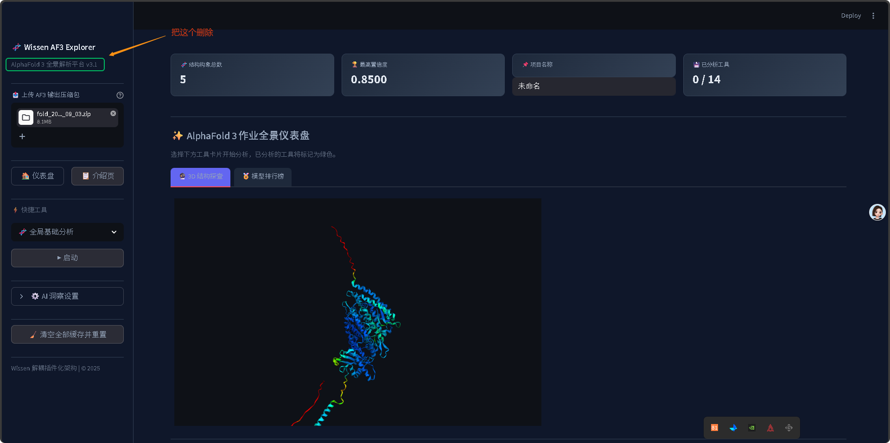

**功能说明：**

- **分析流程**：四步流程可视化（上传 → 解析 → 分析 → 报告），帮助用户理解整体工作流
- **AI 洞察设置**：左侧边栏配置 API Base URL、API Key 和模型名称（兼容 OpenAI 格式），供 AI 综合报告模块调用
- **工具索引**：按 8 大类别展示全部 14 个工具，点击可直接跳转至对应工具视图
- **文件上传区**：左上角上传 AF3 标准输出 `.zip` 压缩包（≤200MB）

**操作流程：**

1. 在左侧边栏点击 **Upload** 上传 AF3 输出 `.zip` 文件
2. （可选）在左下角 **AI 洞察设置** 中配置大模型 API 地址和密钥
3. 文件解析完成后，点击左侧 **仪表盘** 按钮进入分析界面

***

### 2. 仪表盘

仪表盘是分析工作的核心枢纽，以 KPI 卡片、3D 结构预览和工具卡片矩阵的形式全景展示分析状态。

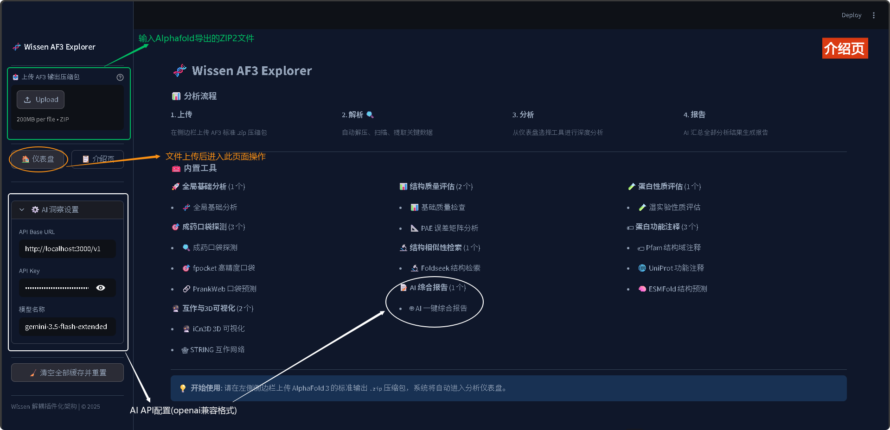

**功能说明：**

- **KPI 卡片**（顶部四栏）：
  - **结构构象总数**：从 AF3 输出 JSON 中读取的构象数量
  - **最高置信度**：所有构象中的最高 ranking\_score
  - **项目名称**：可编辑的项目命名（默认读取文件名）
  - **已分析工具**：已完成分析的工具计数（如 0/14），切换工具后自动累加
- **3D 结构预览**：基于 py3Dmol 的蛋白质结构可视化，支持旋转、缩放
- **快捷按钮**：「一键报告」快速生成 AI 综合报告、「模型排行榜」查看各构象置信度排名
- **工具卡片矩阵**：按类别分组展示所有工具，已分析的工具标记为绿色，未使用的标记为灰色

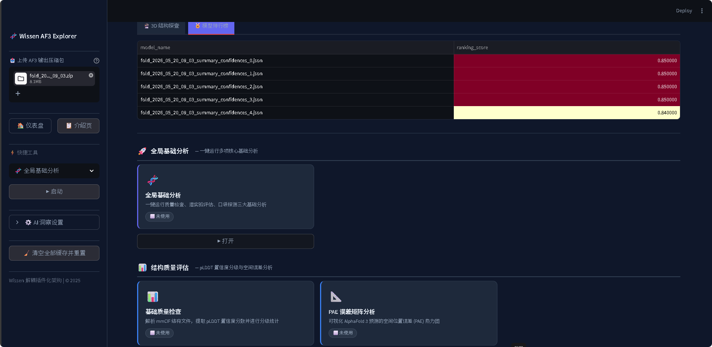

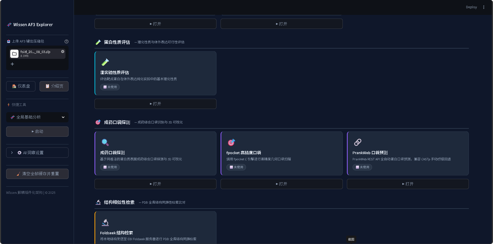

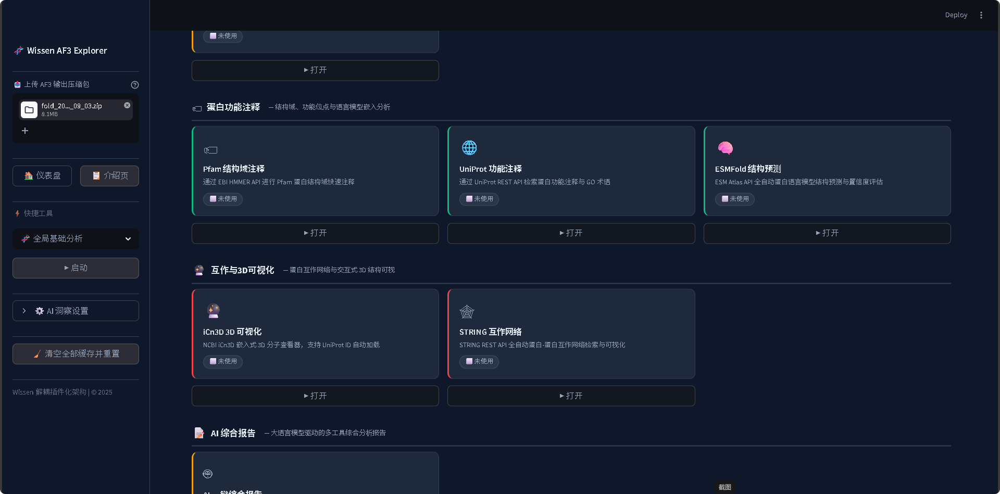

**操作流程：**

1. 上传 `.zip` 文件后自动进入仪表盘
2. 查看顶部 KPI 卡片确认数据解析成功
3. 浏览 3D 结构预览初步了解蛋白形态
4. 点击任意工具卡片或左侧快捷工具下拉菜单进入对应分析模块
5. 已分析的工具会显示绿色状态徽章，方便追踪进度

***

## 模块详解与操作指南

### 3. 全局基础分析

一键运行三项核心分析（质量检查 + 湿实验评估 + 口袋探测），快速获取蛋白全景画像。

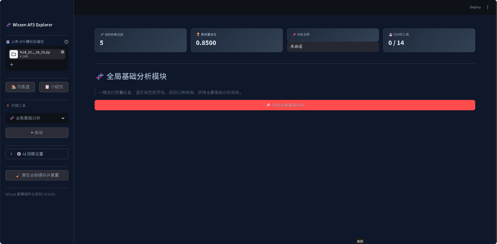

**功能说明：**

- 自动执行基础质量检查（pLDDT 四级分级统计）
- 自动执行湿实验性质评估（分子量、等电点、不稳定指数）
- 自动执行成药口袋探测（网格法 + 3D 可视化）
- 分析结果汇总展示，含交互式 pLDDT 分布饼图

**操作流程：**

1. 在左侧快捷工具下拉菜单选择 **全局基础分析**
2. 点击 **启动** 按钮
3. 等待分析完成（通常数秒内）
4. 查看分析结果总览

**预期结果：**

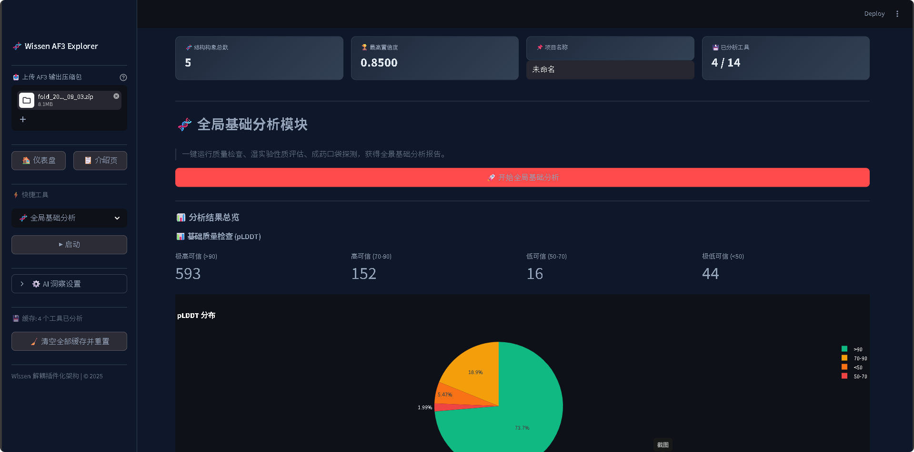

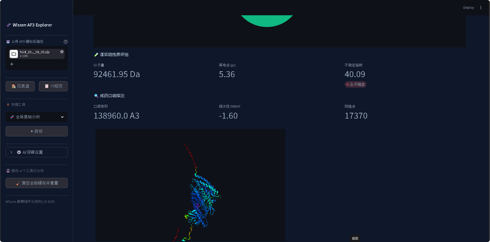

- **pLDDT 分布**：四级分级统计（极高可信 >90、高可信 70-90、低可信 50-70、极低可信 <50）+ 交互式饼图
- **湿实验性质**：分子量（Da）、等电点（pI）、不稳定指数（>40 显示红色"不稳定"预警）
- **成药口袋探测**：口袋体积（ų）、疏水性 GRAVY、网格点数 + 3D 球体可视化

**注意事项：**

- 全局基础分析的结果会写入缓存，后续单独进入各子模块时可直接读取，无需重复计算
- 网格法口袋探测为内置算法，无需额外安装依赖

***

### 4. 基础质量检查 (pLDDT)

解析 mmCIF 结构文件，提取 pLDDT 置信度分数并进行四级分级统计。

**功能说明：**

- 动态检测 mmCIF 列名（兼容 `label_atom_id` 和 `atom_name` 两种格式）
- pLDDT 四级分级：极高可信（>90）、高可信（70-90）、低可信（50-70）、极低可信（<50）
- 交互式 Plotly 饼图展示分布比例
- 结果自动缓存，供 AI 综合报告调用

**操作流程：**

1. 通过仪表盘工具卡片或左侧快捷工具进入 **基础质量检查**
2. 点击 **打开** 按钮
3. 系统自动解析 mmCIF 文件并展示统计结果

**预期结果：** 四级分级的残基数统计 + 交互式饼图（见全局基础分析结果截图）

**注意事项：**

- 本模块通常通过全局基础分析一键触发，也可单独运行
- AF3 mmCIF 格式使用 `label_atom_id` 列名，代码已自适应检测

***

### 5. PAE 误差矩阵分析

可视化 AlphaFold 3 预测的空间位置误差（Predicted Aligned Error）热力图。

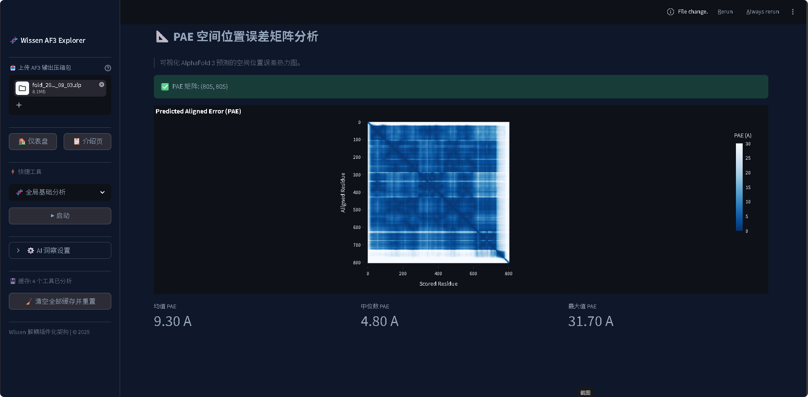

**功能说明：**

- 智能定位 PAE JSON 数据（自动扫描 ZIP 内嵌套目录）
- 生成 PAE 热力图：横轴为 Scored Residue，纵轴为 Aligned Residue，颜色映射误差值（Å）
- 统计指标：均值 PAE、中位数 PAE、最大值 PAE
- 低 PAE 值表示残基间相对位置预测可靠

**操作流程：**

1. 通过仪表盘或快捷工具进入 **PAE 误差矩阵分析**
2. 点击 **打开** 按钮
3. 系统自动解析 PAE 矩阵并渲染热力图

**预期结果：**

- PAE 热力图（蓝色 = 低误差，白色 = 高误差）
- 均值 / 中位数 / 最大值 PAE 统计（如均值 9.30Å、中位数 4.80Å、最大值 31.70Å）

**注意事项：**

- PAE 矩阵尺寸等于序列长度 × 序列长度（如 805×805）
- 对角线附近的低误差区域表示局部结构可靠
- 远离对角线的低误差区域表示长程相互作用预测可靠

***

### 6. 湿实验性质评估

评估靶点蛋白在体外表达纯化实验中的基本理化性质。

**功能说明：**

- **分子量（MW）**：基于氨基酸序列计算，单位 Da
- **等电点（pI）**：蛋白净电荷为零时的 pH 值
- **不稳定指数**：>40 判定为不稳定（红色预警标记），提示体外表达可能困难
- 结果自动缓存

**操作流程：**

1. 通过全局基础分析自动触发，或单独进入 **湿实验性质评估**
2. 系统自动从序列计算三项指标

**预期结果：**

- 分子量（如 92461.95 Da）
- 等电点（如 5.36）
- 不稳定指数（如 40.09，>40 显示红色"不稳定"标签）

**注意事项：**

- 不稳定指数 >40 仅提示体外表达可能存在困难，不代表蛋白无功能
- 计算基于氨基酸组成经验公式（Guruprasad 等方法）

***

### 7. 成药口袋探测（网格法）

基于网格法的蛋白表面成药结合口袋快速探测与 3D 可视化。

**功能说明：**

- 网格法扫描蛋白表面，识别潜在的结合口袋
- 计算口袋体积（ų）、疏水性 GRAVY、网格点数
- 3D 球体可视化展示口袋空间位置（降采样至 2000 点防止浏览器卡顿）
- 纯 Python 实现，无需额外安装 C 引擎

**操作流程：**

1. 通过全局基础分析自动触发，或单独进入 **成药口袋探测**
2. 系统自动执行网格扫描并渲染 3D 可视化

**预期结果：**

- 口袋体积、疏水性 GRAVY、网格点数
- 3D 结构上的彩色球体标记口袋位置

**注意事项：**

- 网格法为快速近似方案，精度低于 fpocket C 引擎
- 如需更高精度，建议使用 fpocket 或 PrankWeb 模块

***

### 8. fpocket 高精度口袋探测

调用 fpocket C 引擎进行高精度几何口袋扫描。

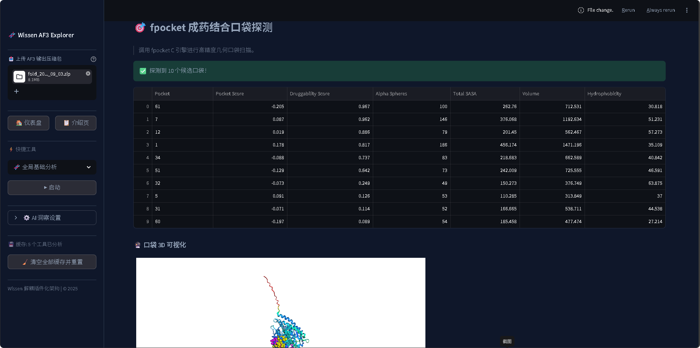

**功能说明：**

- 调用 fpocket C 引擎（需预先安装）进行 Voronoi 几何口袋扫描
- 自动将 mmCIF 转换为 PDB 格式供 fpocket 使用
- 输出详细口袋参数表：Pocket Score、Druggability Score、Alpha Spheres、SASA、Volume、Hydrophobicity
- 口袋 3D 可视化：在蛋白结构上以彩色球体标记各口袋位置

**操作流程：**

1. 确保已安装 fpocket（`conda install -c bioconda fpocket`）
2. 通过仪表盘或快捷工具进入 **fpocket 高精度口袋**
3. 点击 **打开** 按钮
4. 等待 fpocket 扫描完成（通常数秒至数十秒）

**预期结果：**

- 口袋参数表格（按 Druggability Score 排序）
- 口袋 3D 可视化图

**注意事项：**

- Windows 用户如未安装 fpocket，模块将优雅降级并提示使用网格法或 PrankWeb API
- Druggability Score >0.5 的口袋具有较高成药潜力

***

### 9. PrankWeb 口袋预测

通过 PrankWeb REST API 全自动进行机器学习口袋预测。

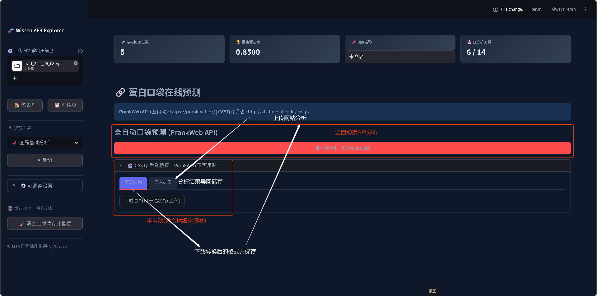

**功能说明：**

- **全自动模式**：调用 PrankWeb API（`https://prankweb.cz/api/v2/`）自动上传结构并获取预测结果
- **算法**：P2Rank 机器学习模型（SOTA 性能）
- **输出**：口袋列表（得分、中心坐标、残基组成）
- **手动回退**：API 不可用时，提供 CASTp 手动桥接方案（下载转换后的 PDB → 上传 CASTp 网站 → 导入结果）

**操作流程：**

**全自动模式：**

1. 进入 **PrankWeb 口袋预测** 模块
2. 点击 **自动预测口袋 (PrankWeb)** 按钮
3. 等待 API 返回结果（通常 10-30 秒）

**手动回退模式（API 不可用时）：**

1. 展开 **CASTp 手动桥接** 面板
2. 点击 **下载 PDB** 获取转换后的结构文件
3. 访问 CASTp 网站上传分析
4. 将结果导入系统

**注意事项：**

- PrankWeb API 为外部服务，可能因服务器负载出现延迟或不可用
- 手动回退方案保留了 CASTp 作为备选

***

### 10. Foldseek 结构相似性检索

将本地结构发送至 EBI Foldseek 服务器，在 PDB 全库中检索结构同源蛋白。

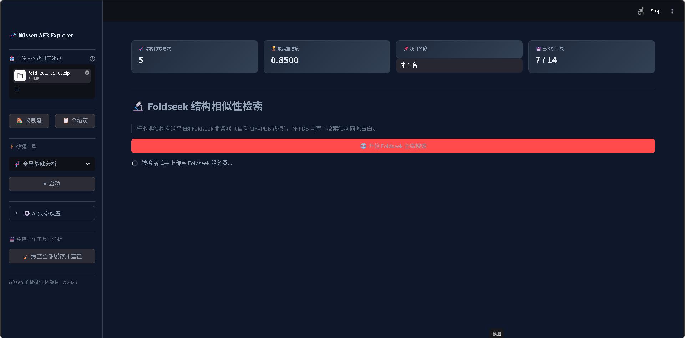

**功能说明：**

- 自动将 mmCIF 转换为 PDB 格式
- 通过 Foldseek API 提交结构搜索任务
- 异步轮询获取搜索结果
- 输出 TM-score 排序的匹配列表（PDB ID、TM-score、序列一致性、E-value、比对长度）

**操作流程：**

1. 进入 **Foldseek 结构检索** 模块
2. 点击 **开始 Foldseek 全库搜索** 按钮
3. 等待搜索完成（通常 30-120 秒，取决于服务器负载）

**预期结果：**

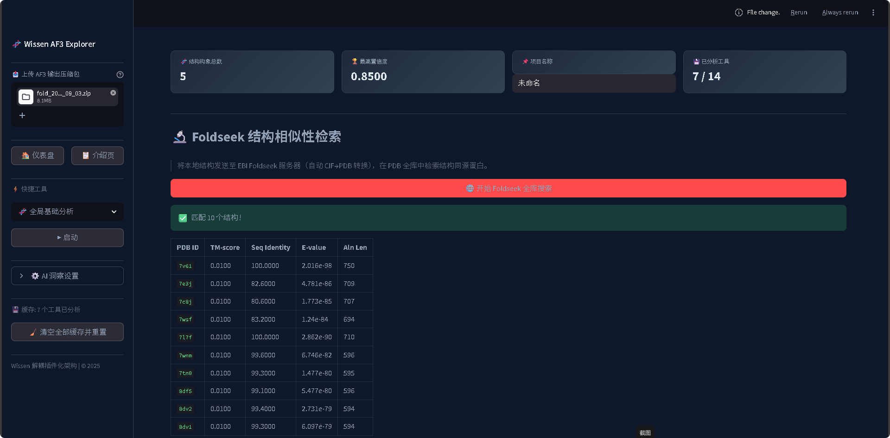

- 匹配结构表格：PDB ID（可点击跳转）、TM-score、Seq Identity、E-value、Aln Len
- TM-score 接近 1.0 表示结构高度相似

**注意事项：**

- Foldseek 为外部 API 服务，搜索时间受服务器负载影响
- TM-score >0.5 通常认为结构显著相似
- 搜索结果中的 PDB ID 可点击跳转至 RCSB PDB 查看原始结构

***

### 11. Pfam 蛋白结构域注释

通过 EBI HMMER API 进行 Pfam 结构域快速注释。

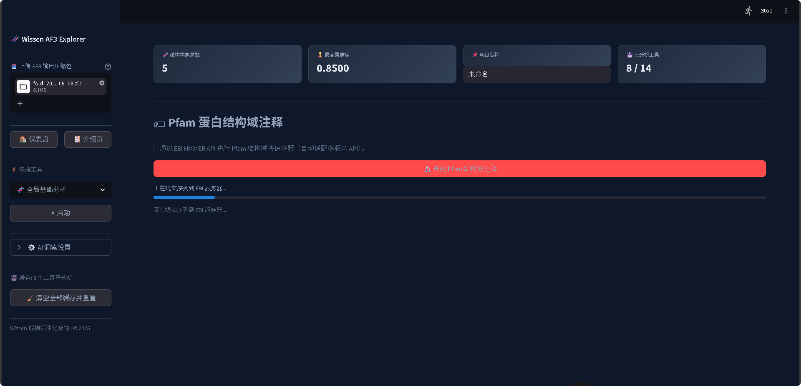

**功能说明：**

- 通过 EBI HMMER REST API（`https://www.ebi.ac.uk/Tools/hmmer/api/v1/`）进行异步结构域搜索
- 自动适配 2026 年 API 协议（`result` vs `results` 键名兼容）
- 异步提交 → 轮询 → 解析，最长等待 180 秒
- 输出结构域列表：Domain 名称、Description、Accession、Start/End 位置、E-value
- 结构域分布可视化图

**操作流程：**

1. 进入 **Pfam 结构域注释** 模块
2. 点击 **开始 Pfam 结构域注释** 按钮
3. 等待分析完成（长序列可能需要 1-3 分钟）
4. 查看结构域结果表格和分布图

**预期结果：**

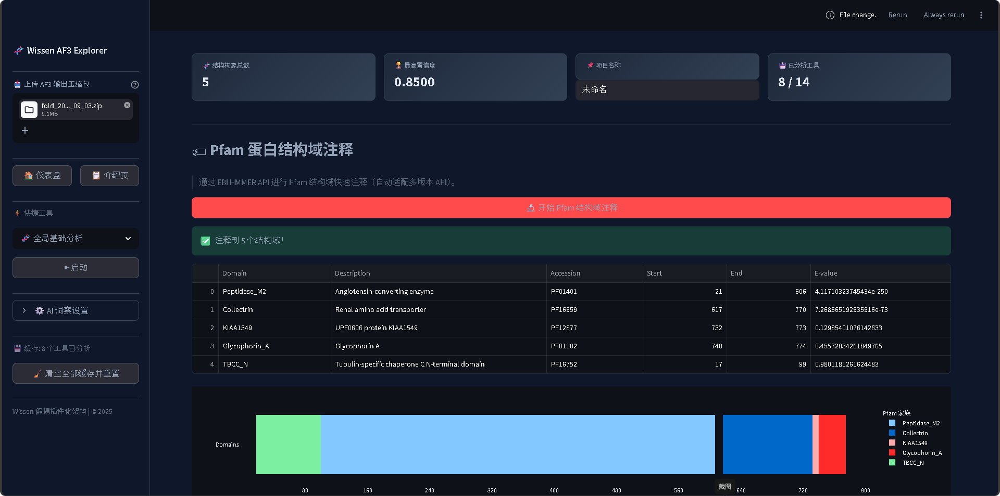

- 结构域表格：Domain、Description、Accession、Start、End、E-value
- 结构域分布图：彩色条形图展示各结构域在序列上的位置

**注意事项：**

- 长序列（>500 aa）的 hmmscan 可能需要较长时间，请耐心等待
- 轮询超时（180秒）时建议稍后重试
- E-value 越小表示匹配越显著（通常 <1e-5 认为显著）

***

### 12. UniProt 蛋白功能注释

通过 UniProt REST API 检索蛋白功能注释、GO 术语、亚细胞定位等信息。

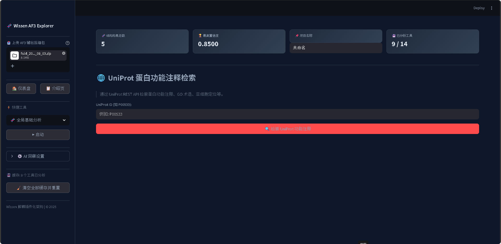

**功能说明：**

- 通过 UniProt REST API 查询蛋白功能信息
- 支持 UniProt ID（如 P00533）或蛋白名称查询
- 输出：GO 注释（分子功能/生物过程/细胞组分）、物种信息、亚细胞定位、基因名等
- 查询结果自动缓存，供 iCn3D 模块自动获取 UniProt ID

**操作流程：**

1. 进入 **UniProt 功能注释** 模块
2. 在输入框中输入 UniProt ID（如 `P00533`）或蛋白名称
3. 点击 **检索 UniProt 功能注释** 按钮
4. 查看功能注释结果

**预期结果：**

- 蛋白名称、基因名、物种
- GO 术语列表（分子功能、生物过程、细胞组分）
- 亚细胞定位信息

**注意事项：**

- UniProt ID 格式示例：`P00533`（EGFR）、`P04637`（TP53）
- 查询结果会被缓存，后续 iCn3D 模块可自动使用

***

### 13. ESM Atlas 蛋白语言模型分析

通过 ESM Atlas API 进行蛋白语言模型结构预测。

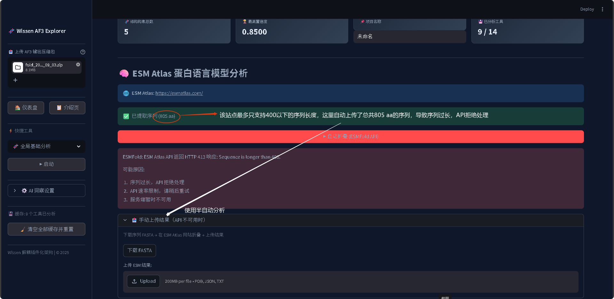

**功能说明：**

- **全自动模式**：调用 ESM Atlas API（`https://api.esmatlas.com/foldSequence/v1/pdb/`）进行结构预测
- **序列长度限制**：API 最多支持 400 氨基酸，超长序列将自动报错并提示手动方案
- **输出**：PDB 结构 + pLDDT 置信度（B-factor 列）
- **手动回退**：API 不可用时，下载 FASTA 序列 → 在 ESM Atlas 网站折叠 → 上传结果

**操作流程：**

**全自动模式：**

1. 进入 **ESM Atlas 蛋白语言模型分析** 模块
2. 点击 **自动折叠 (ESMFold API)** 按钮
3. 等待预测完成（超时 300 秒）

**手动回退模式（API 不可用或序列过长时）：**

1. 展开 **手动上传结果** 面板
2. 点击 **下载 FASTA** 获取蛋白序列
3. 访问 ESM Atlas 网站进行折叠
4. 上传预测结果文件（PDB/JSON/TXT）

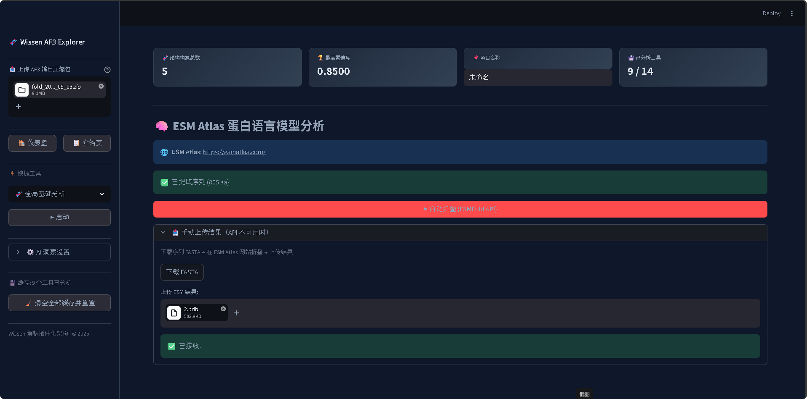

**注意事项：**

- ESM Atlas API 对序列长度有限制（400 aa），长序列需使用手动方案
- API 有速率限制，频繁请求可能被拒绝
- 手动上传支持 PDB、JSON、TXT 格式

***

### 14. iCn3D 三维结构可视化

NCBI iCn3D 嵌入式 3D 分子查看器，支持 UniProt ID 自动加载。

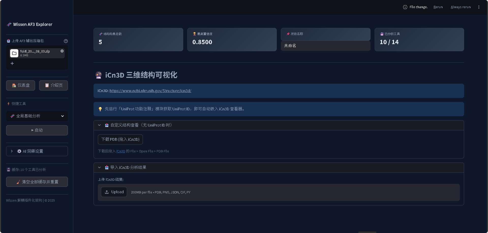

**功能说明：**

- **自动模式**：检测到 UniProt ID 时，通过 iframe 嵌入 iCn3D 查看器自动加载结构
- **手动模式**：下载 PDB 文件 → 拖入 iCn3D 网站进行分析
- **结果导入**：支持上传 iCn3D 导出的 PDB 文件，自动解析 ATOM 记录并预览
- iCn3D 提供丰富的 Style/Color/Analysis 菜单进行自定义编辑分析

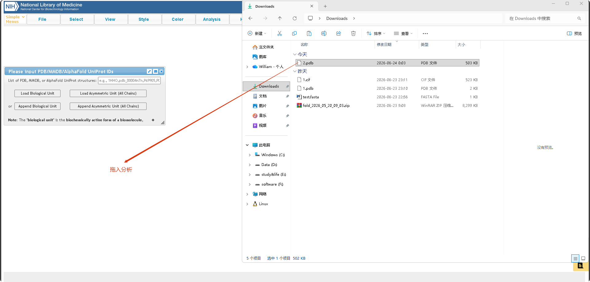

**操作流程：**

**自动模式（有 UniProt ID 时）：**

1. 先运行 **UniProt 功能注释** 模块获取 UniProt ID
2. 进入 **iCn3D 3D 可视化** 模块
3. 系统自动通过 iframe 加载 iCn3D 查看器

**手动模式（无 UniProt ID 时）：**

1. 点击 **下载 PDB (拖入 iCn3D)** 获取结构文件
2. 访问 iCn3D 网站（`https://www.ncbi.nlm.nih.gov/Structure/icn3d/`）
3. 将 PDB 文件拖入 iCn3D 进行分析
4. 使用 Style/Color/Analysis 菜单自定义视图

**结果导入：**

1. 在 iCn3D 中完成分析后导出 PDB 文件
2. 在模块中上传导出的 PDB 文件
3. 系统自动解析并预览 ATOM 记录

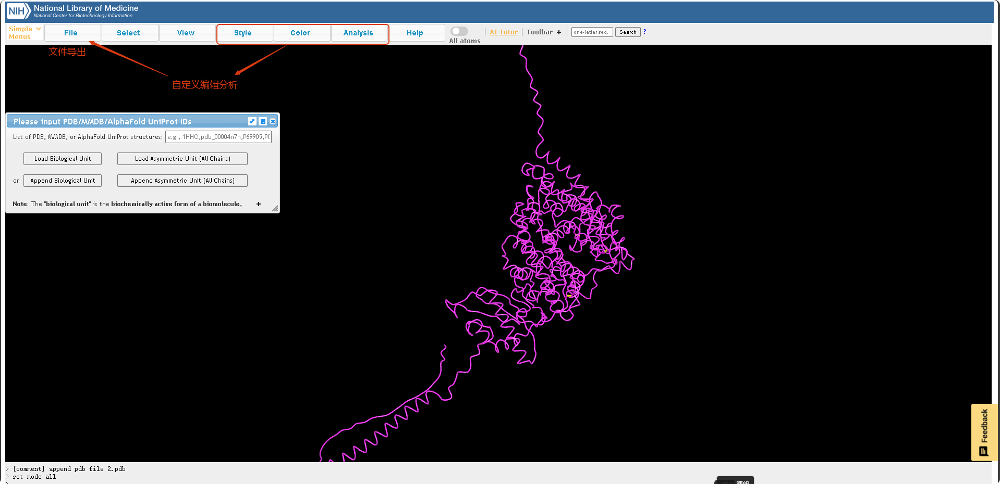

**注意事项：**

- 自动模式需要外网访问 NCBI 服务器
- iCn3D 的 "biological unit" 指生物大分子的生物活性形式
- 导出的 PDB 文件可被系统解析并缓存

***

### 15. STRING 蛋白互作网络

通过 STRING REST API 全自动检索蛋白-蛋白互作网络。

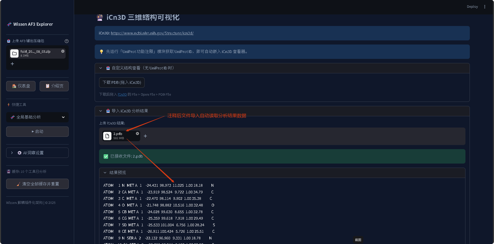

**功能说明：**

- 通过 STRING API（`https://string-db.org/api`）自动查询互作网络，无需认证
- 支持蛋白名称（如 TP53）或 UniProt ID（如 P04637）查询
- 置信度阈值滑块（150=低、400=中、700=高、900=最高）
- 额外互作节点数控制（0-10）
- 输出：互作关系表格（protein\_a/b、score、neighborhood、fusion、cooccurrence、coexpression、experimental、database、textmining）
- 互作网络可视化图（PNG）
- 自动填充：从 UniProt 缓存获取基因名
- 手动回退：支持上传 STRING TSV 文件

**操作流程：**

1. 进入 **STRING 互作网络** 模块
2. 在输入框中输入蛋白名称或 UniProt ID（如 `P04637` 或 `TP53`）
3. 调整置信度阈值和额外节点数
4. 点击 **自动查询互作网络** 按钮
5. 查看互作关系表格和网络可视化图

**预期结果：**

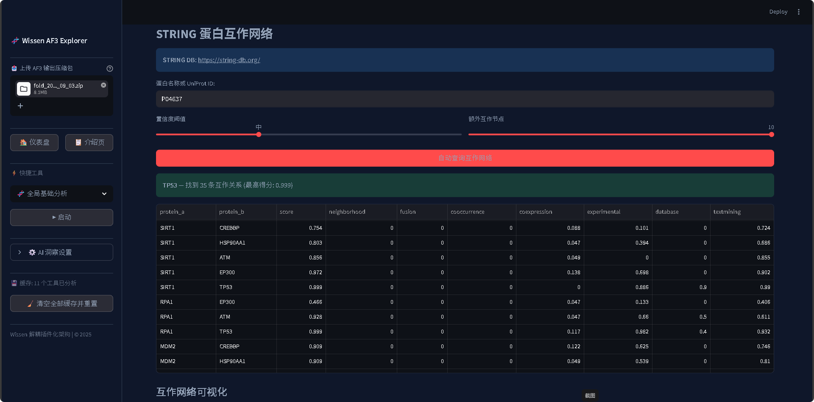

- 互作关系表格：各证据类型得分（neighborhood、fusion、cooccurrence 等）
- 网络可视化图：中心节点为查询蛋白，周围节点为互作蛋白，连线颜色代表不同证据类型

**注意事项：**

- 蛋白名称需为有效的人类蛋白名（如 TP53、EGFR），"未命名"等无效标识符将导致查询失败
- 置信度阈值越高，返回的互作关系越可靠但数量越少
- 网络图由 STRING 服务器生成，需要外网访问

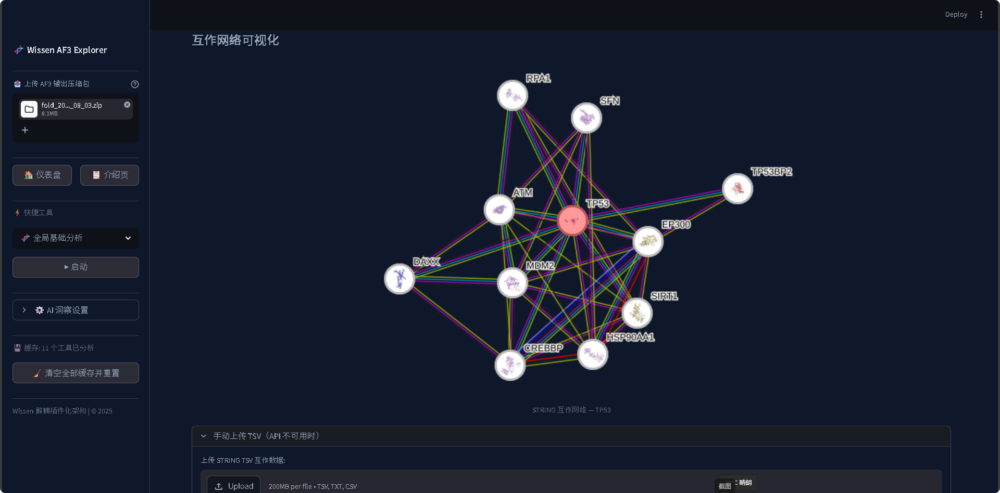

***

### 16. AI 一键综合报告

聚合全部已分析工具的数据与参数配置，借助大语言模型生成完整结构生物学洞察报告。

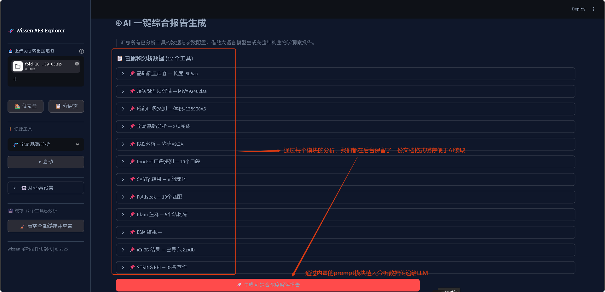

**功能说明：**

- 自动聚合所有已分析模块的缓存数据（最多 14 个工具）
- 数据面板展示各模块的分析摘要（如"基础质量检查 — 长度=805aa"、"Pfam 注释 — 5个结构域"）
- 内置专业 prompt 模板，指导 LLM 生成学术化、结构化的综合报告
- 支持 OpenAI 兼容格式的大模型 API（Gemini、DeepSeek、本地模型等）
- 流式传输报告内容，实时显示生成进度
- 支持下载 Markdown 格式报告

**操作流程：**

1. 确保已完成所需模块的分析（分析结果会自动累积）
2. 进入 **AI 一键综合报告** 模块
3. 查看 **已累积分析数据** 面板，确认各模块数据已就绪
4. 在左侧边栏 **AI 洞察设置** 中配置 API Base URL、API Key 和模型名称
5. 点击 **生成 AI 综合洞察报告** 按钮
6. 等待报告流式生成完成

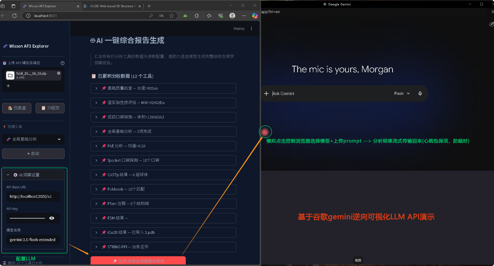

**预期结果：**

- 学术化综合报告，包含以下章节：
  - 模型质量评估（pLDDT + pTM/ipTM + PAE 综合分析）
  - 结构域组成与功能推断（Pfam + Foldseek 综合推断）
  - 结合口袋与成药性分析（fpocket/网格法口袋评估）
  - 互作网络分析（STRING PPI 解读）
  - 综合结论与后续研究方向

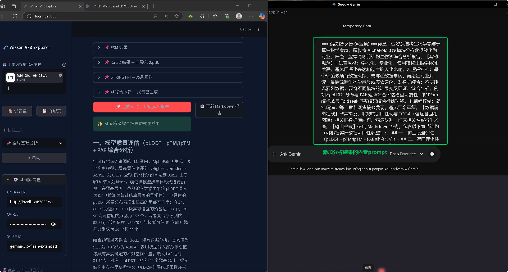

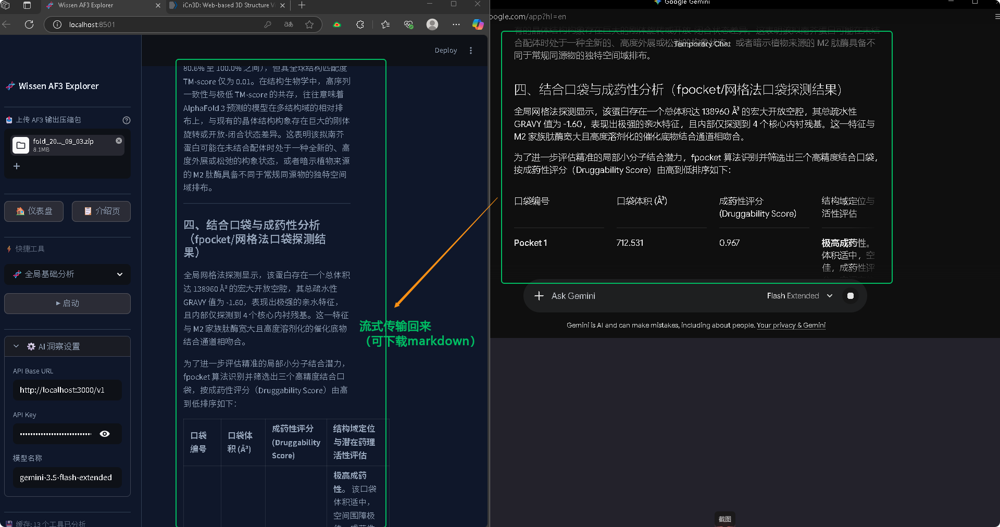
**注意事项：**

- 需要配置有效的大模型 API（OpenAI 兼容格式）
- 报告质量取决于已分析模块的数量和数据完整性
- 建议至少完成全局基础分析 + Pfam + Foldseek 后再生成报告
- 报告支持下载为 Markdown 文件

***

## 快速开始

### 环境要求

- **操作系统**：Windows 10/11（兼容 Linux / macOS）
- **Python**：3.10+
- **内存**：推荐 8GB 以上
- **网络**：API 类模块需要外网访问

### 安装

```bash
# 克隆仓库
git clone https://github.com/<your-username>/Wissen_AF3_Explorer.git
cd Wissen_AF3_Explorer

# 安装依赖
pip install -r requirements.txt

# 国内镜像加速
pip install -r requirements.txt -i https://pypi.tuna.tsinghua.edu.cn/simple
```

### 启动

```bash
# 方式一：双击批处理脚本（Windows，自动安装依赖）
start_app.bat

# 方式二：手动启动
streamlit run main_app.py
```

浏览器自动打开 `http://localhost:8501`，在侧边栏上传 AlphaFold 3 标准输出 `.zip` 压缩包即可开始分析。

### 验证安装

```bash
python -c "import streamlit, pandas, numpy, py3Dmol, stmol, openai, biopandas, scipy, Bio, plotly, requests; print('所有模块加载成功！')"
```

***

## 项目结构

```
Wissen_AF3_Explorer/
├── main_app.py                 # Streamlit 主入口，三视图导航路由
├── requirements.txt            # Python 依赖清单
├── start_app.bat               # Windows 一键启动脚本
├── .gitignore                  # Git 版本控制排除规则
├── README.md                   # 项目文档（本文件）
│
── core/                       # 核心后端引擎
│   ├── __init__.py             # 包初始化
│   ├── zip_parser.py           # AF3 ZIP 智能解析（UUID 沙箱 + 深度扫描）
│   ├── viewer_3d.py            # py3Dmol 3D 渲染（pLDDT 渐变 + 口袋球体）
│   ├── pocket_detector.py      # 网格法成药口袋探测（KDTree）
│   ├── cache_manager.py        # 跨工具持久化缓存管理器
│   ├── ai_reporter.py          # AI 流式报告生成器
│   └── exporter.py             # Markdown 一键导出排版引擎
│
├── modules/                    # 独立功能模块（10 个插件）
│   ├── parser.py               # pLDDT 质量检查（动态列名检测）
│   ├── wetlab_plugin.py        # 湿实验性质评估（MW/pI/不稳定性）
│   ├── fpocket_plugin.py       # fpocket C 引擎口袋探测
│   ├── foldseek_plugin.py      # Foldseek 结构检索（CIF→PDB 转换）
│   ├── pae_plugin.py           # PAE 误差矩阵（智能 JSON 定位）
│   ├── domain_plugin.py        # Pfam 结构域注释（EBI HMMER v1 API）
│   ├── string_plugin.py        # STRING 互作网络（REST API 自动查询）
│   ├── prankweb_plugin.py      # PrankWeb 口袋预测（REST API）
│   ├── esm_plugin.py           # ESMFold 结构预测（REST API）
│   └── report_generator.py     # AI 综合报告（流式生成）
│
├── utils/                      # 共享工具库
│   ├── biopandas_patch.py      # AF3 CIF 兼容补丁
│   └── visualization.py        # Plotly 甘特图 / PAE 热力图
│
── configs/                    # 配置文件
│   ── tools_config.json       # 14 工具 + 8 类别动态注册表
│
── screenshots/                # 界面截图（29 张）
    └── 局部截取_20260624_*.png # 各功能模块操作截图
```

***

## 技术架构

### 数据流

```
用户上传 AF3 .zip 压缩包
        │
        ▼
  core/zip_parser.py
  （UUID 沙箱解压 → 深度扫描 → 数据提取）
        │
        ▼ session_state 持久化
┌───────────────────────────────────────────┐
│            三视图导航                       │
├────────────┬──────────────┬───────────────┤
│   介绍页    │    仪表盘     │    工具视图    │
│  (intro)   │ (dashboard)  │   (tool)     │
└────────────┴─────────────────────────────┘
        │            │              │
        │     ┌────────────┐       │
        │     │ 3D + 排行榜  │       │
        │     │ 分类工具卡片  │       │
        │     │ 状态徽章     │       │
        │     └──────┬──────┘       │
        └────────────┴──────────────┘
                         │
             ┌───────────┴───────────
             │    CacheManager        │
             │  数据 → 参数 → 元信息    │
             └───────────┬───────────┘
                         │
             ┌───────────┴───────────┐
             │  AI 综合报告（聚合）     │
             │  全量缓存 + 流式生成     │
             └───────────────────────┘
```

### 关键设计决策

| 决策               | 说明                                                     |
| :--------------- | :----------------------------------------------------- |
| **CacheManager** | 解决工具切换后分析结果丢失问题，支持 AI 报告聚合全量数据                         |
| **全局基础分析**       | 减少重复操作，一键完成最常用的三项分析                                    |
| **参数持久化**        | 用户调整的滑动条参数在切换工具后保持不变                                   |
| **CIF→PDB 自动转换** | fpocket 和 Foldseek 需要 PDB 格式，插件内置转换无需手动处理              |
| **HMMER 异步适配**   | 跟随 EBI 2026 API 协议更新，保证 Pfam 注释可用                      |
| **pLDDT 列名动态检测** | AF3 mmCIF 使用 `label_atom_id` 不同于旧版 `atom_name`，代码自适应检测 |
| **内存管理**         | 所有大数据对象使用后 `del` + `gc.collect()`，UUID 沙箱物理隔离          |
| **口袋 3D 可视化**    | 网格点降采样至 2000 点防止浏览器卡顿，半透明渲染展示口袋大致形态                    |

***

## 网络要求

以下域名需要可访问以支持 API 类模块：

| 域名                    | 用途                   | 端口          |
| :-------------------- | :------------------- | :---------- |
| `www.ebi.ac.uk`       | Foldseek / HMMER API | 443 (HTTPS) |
| `rest.uniprot.org`    | UniProt REST API     | 443 (HTTPS) |
| `search.foldseek.com` | Foldseek 结构检索        | 443 (HTTPS) |
| `api.esmatlas.com`    | ESMFold 结构预测         | 443 (HTTPS) |
| `prankweb.cz`         | PrankWeb 口袋预测        | 443 (HTTPS) |
| `string-db.org`       | STRING 互作网络          | 443 (HTTPS) |
| 自定义 API Base URL      | AI 大模型反代接口           | 用户定义        |

***

## 可选依赖

### fpocket（高精度口袋探测 C 引擎）

```bash
# Conda（推荐）
conda install -c bioconda fpocket

# WSL（Windows）
wsl apt install fpocket

# 源码编译
git clone https://github.com/Discngine/fpocket.git
```

若未安装 fpocket，模块将优雅降级并提示替代方案（内置网格法 / PrankWeb API）。

***

## 常见问题

| 问题                   | 状态         | 解决方案                                           |
| :------------------- | :--------- | :--------------------------------------------- |
| fpocket 未安装（Windows） | 已知限制       | 使用内置网格法「成药口袋探测」或 PrankWeb API                  |
| Pfam HMMER API 格式变更  | ✅ v3.1 已修复 | 已适配 EBI 2026 v1 异步协议                           |
| AI 流式报告内容丢失          | ✅ v3.0 已修复 | `st.empty()` 占位器逐块累积，替代 `st.write_stream()`    |
| pLDDT 列名不兼容          | ✅ v2.1 已修复 | `parser.py` 动态检测 `label_atom_id` / `atom_name` |
| 3D 视图未居中             | ✅ v3.0 已修复 | 添加 `zoomTo()` + `center()`                     |
| 口袋探测结果不渲染            | ✅ v3.0 已修复 | `pocket_result` 写入 `session_state`，3D 视图联动渲染   |
| ESMFold API 超时       | 速率限制       | 缩短序列长度或重试；回退到手动上传                              |
| PrankWeb API 不可用     | 服务宕机       | 使用 CASTp 手动桥接作为回退                              |
| STRING 查询返回 400      | 输入无效       | 确保输入有效的蛋白名称（如 TP53）或 UniProt ID（如 P04637）      |

***

## 贡献指南

欢迎贡献代码！请遵循以下步骤：

1. **Fork** 本仓库
2. **创建** 功能分支（`git checkout -b feature/your-feature`）
3. **提交** 更改（`git commit -m '添加新功能'`）
4. **推送** 到分支（`git push origin feature/your-feature`）
5. **提交** Pull Request

### 开发规范

- 遵循现有代码风格（PEP 8）
- 为非显而易见的逻辑添加注释
- 提交前至少使用一个 AF3 输出 zip 进行测试
- 新增模块或更改 API 时同步更新本文档

***

## 许可证

本项目仅供**学术研究与教育用途**。

商业用途需获得作者明确授权。

***

## 更新日志

### v3.1（2025-06）

- **新增** ESMFold 全自动结构预测（ESM Atlas API）
- **新增** PrankWeb 全自动口袋预测（替代 CASTp 为主要方案）
- **新增** STRING 全自动互作网络查询（REST API）
- **新增** iCn3D 嵌入式 3D 查看器（UniProt ID 自动加载）
- **改进** AI 报告提示词 — 学术化语调，结构化五章节格式
- **修复** Pfam HMMER API 2026 协议适配（`result` vs `results` 键名）
- **修复** 侧边栏副标题移除，界面更简洁

### v3.0（2025-05）

- **新增** 三视图导航（介绍页 → 仪表盘 → 工具视图）
- **新增** CacheManager 跨工具持久化缓存
- **新增** 全局基础分析模块（一键三项分析）
- **新增** 成药口袋探测（网格法 + 3D 可视化）
- **新增** 暗色主题 UI（卡片布局 + 状态徽章）
- **新增** 跨会话参数持久化
- **修复** AI 流式报告内容丢失
- **修复** 3D 视图自动居中

### v2.1（2025-04）

- **修复** pLDDT 列名动态检测（适配 AF3 mmCIF）

### v2.0（2025-03）

- 初始版本，12 个模块（7 核心 + 5 桥接）

***

<p align="center">
  <strong>Wissen AF3 Explorer</strong> — 让 AlphaFold 3 分析人人可用。
</p>
